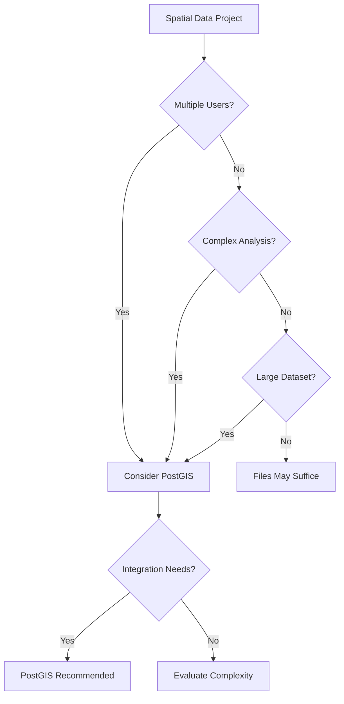

# GIST 604B Module 6 - PostGIS Spatial Database

## 📖 Overview

This directory contains the complete curriculum materials for **Module 6: PostGIS Spatial Database** of GIST 604B - Open Source GIS Programming. This module teaches GIS professionals how to leverage spatial databases for enterprise-level geospatial data management and analysis.

**Course Context:** GIST 604B - Open Source GIS Programming  
**Target Students:** GIS professionals transitioning to database-driven workflows  
**Learning Focus:** Spatial database fundamentals and professional workflows  
**Professional Goal:** Enterprise GIS skills and data management expertise  

---

## 🎯 Module Learning Objectives

By completing Module 6, students will be able to:

1. **Database Fundamentals:** Understand when and why to use spatial databases
2. **PostGIS Basics:** Load, query, and manage spatial data in PostgreSQL/PostGIS
3. **Spatial Analysis:** Perform complex spatial operations using SQL
4. **Advanced Queries:** Optimize performance and integrate with other systems
5. **Professional Workflows:** Apply database best practices in GIS projects

### 📈 Skill Progression

```
Foundation    →    Application    →    Integration    →    Optimization
SQL Basics    →   Spatial Queries →  Complex Analysis → Performance & APIs
```

---

## 📁 Directory Structure

### 🚀 **Production Assignments** (Ready for Classroom Use)

#### `postgis-basics/`
**Assignment:** PostGIS Fundamentals - Database Setup and Basic Queries  
**Status:** ✅ **Production Ready**  
**Points:** 20 (4 functions × 5 points each)  
**Focus:** Database connection, data loading, basic spatial queries  

**Learning Objectives:**
- Connect to PostGIS database programmatically
- Load spatial data using Python and SQL
- Execute basic spatial queries and filters
- Export results for further analysis

#### `spatial-analysis/`
**Assignment:** Spatial Analysis with PostGIS  
**Status:** ✅ **Production Ready**  
**Points:** 20 (4 functions × 5 points each)  
**Focus:** Spatial functions, buffers, intersections, spatial joins  

**Learning Objectives:**
- Perform buffer and proximity analysis
- Execute spatial intersections and overlays
- Implement spatial joins across multiple tables
- Calculate geometric properties and measurements

#### `advanced-queries/`
**Assignment:** Advanced PostGIS Operations  
**Status:** ✅ **Production Ready**  
**Points:** 25 (5 functions × 5 points each)  
**Focus:** Complex queries, performance optimization, integration workflows  

**Learning Objectives:**
- Write complex multi-table spatial queries
- Optimize query performance with indexes
- Integrate PostGIS with Python workflows
- Export data in multiple formats
- Apply database best practices

---

### 📚 **Supporting Materials**

#### `lectures/`
Comprehensive lecture materials covering:
- `lecture-spatial-databases-intro.md` - When to use spatial databases
- `lecture-postgis-setup-basics.md` - Installation and configuration
- `lecture-spatial-sql-fundamentals.md` - SQL for spatial data
- `lecture-performance-optimization.md` - Query optimization and indexing
- `lecture-postgis-python-integration.md` - Connecting databases to Python
- `lecture-enterprise-workflows.md` - Professional database practices

---

## 🏗️ Technical Architecture

### Standardized Assignment Structure

Each assignment follows a unified structure:

```
assignment-name/
├── README.md                     # Student instructions
├── src/
│   └── postgis_module.py        # Student implementation file
├── tests/                       # Comprehensive test suite
├── notebooks/                   # Learning materials
├── data/                        # Sample datasets and SQL scripts
├── .github/
│   ├── workflows/
│   │   └── test-and-grade.yml   # CI/CD pipeline
│   └── scripts/
│       └── calculate_grade.py   # Professional grading engine
├── docker-compose.yml           # PostGIS database setup
└── pyproject.toml               # Modern dependency management
```

### Database Environment

All assignments use **Docker Compose** for consistent PostGIS setup:
- **PostgreSQL 15** with **PostGIS 3.4**
- Pre-loaded sample datasets
- Automated database initialization
- Consistent connection parameters
- Easy teardown and recreation

### Professional Grading System

All assignments implement the **unified grading architecture** featuring:

- **Database Testing:** Connection validation and query verification
- **Spatial Accuracy:** Geometric result validation
- **Performance Metrics:** Query execution time monitoring
- **Professional CI/CD:** GitHub Actions with database services
- **Educational Feedback:** SQL query analysis and optimization suggestions

---

## 🎓 Pedagogical Approach

### Student-Centered Design

**Target Audience:** GIS professionals learning enterprise data management
- Basic SQL knowledge assumed
- Focus on practical, job-relevant skills
- Professional development context
- Database concepts for non-DBAs

### Skill Development Strategy

1. **Foundation Building:** Start with familiar spatial concepts in database context
2. **Query Progression:** Build from simple SELECT to complex spatial analysis
3. **Integration Focus:** Connect databases to existing GIS workflows
4. **Performance Awareness:** Understand when databases excel vs. file-based data

### Assessment Philosophy

- **Practical Competency:** Focus on applicable database skills
- **Progressive Complexity:** Each assignment builds spatial SQL expertise
- **Professional Preparation:** Expose students to enterprise database practices
- **Integration Mindset:** Connect databases to broader GIS workflows

---

## 📊 Assignment Difficulty Matrix

| Assignment | Complexity | Time Investment | Prerequisites | Professional Skills |
|------------|------------|-----------------|---------------|-------------------|
| postgis-basics | ⭐⭐ | 3-4 hours | Basic SQL | Database connections |
| spatial-analysis | ⭐⭐⭐ | 4-5 hours | PostGIS basics | Spatial SQL |
| advanced-queries | ⭐⭐⭐⭐ | 5-6 hours | Spatial analysis | Performance optimization |

---

## 🗄️ Database vs. File-Based Storage

### When to Use PostGIS Spatial Databases

**✅ Choose PostGIS When You Need:**
- **Multi-user Access:** Concurrent editing and querying
- **Data Integrity:** ACID transactions and constraints
- **Complex Queries:** Advanced spatial analysis with SQL
- **Large Datasets:** Efficient indexing and query optimization
- **Integration:** Connection with web applications and APIs
- **Enterprise Security:** Role-based access and audit trails

**📄 Stick with Files When You Have:**
- **Simple Analysis:** Basic operations with desktop GIS
- **Single User:** Individual projects without sharing needs
- **Small Datasets:** Under 100MB of spatial data
- **Visualization Focus:** Primary need is mapping, not analysis
- **Desktop Workflow:** Working entirely within QGIS/ArcGIS

### Professional Decision Framework



---

## 🚀 Deployment Status

### Production Assignments (Ready for Use)
- ✅ **postgis-basics** - Fully deployed with Docker environment
- ✅ **spatial-analysis** - Complete with spatial function testing
- ✅ **advanced-queries** - Ready with performance benchmarks

### Success Metrics
- **Database Skills:** Students can set up and query PostGIS
- **Spatial SQL:** Competency in spatial functions and analysis
- **Professional Integration:** Understanding of when to use databases
- **Performance Awareness:** Basic optimization and indexing knowledge

---

## 🔧 Technical Requirements

### System Prerequisites

**Required Software:**
- Docker Desktop (for PostGIS database)
- Python 3.11+ with psycopg2
- Git for version control

**Optional but Recommended:**
- pgAdmin or other PostgreSQL GUI tool
- VS Code with PostgreSQL extensions
- QGIS with PostGIS connectivity

### Database Setup

Each assignment includes Docker Compose configuration:

```yaml
services:
  postgis:
    image: postgis/postgis:15-3.4
    environment:
      POSTGRES_USER: gis_student
      POSTGRES_PASSWORD: gis604b
      POSTGRES_DB: spatial_analysis
    ports:
      - "5432:5432"
    volumes:
      - ./data:/docker-entrypoint-initdb.d
```

### Connection Parameters

**Standard Connection:**
- **Host:** localhost
- **Port:** 5432
- **Database:** spatial_analysis
- **Username:** gis_student
- **Password:** gis604b

---

## 📚 Learning Resources

### For Students
- Step-by-step database setup guides
- SQL reference sheets for spatial functions
- Troubleshooting common connection issues
- Performance optimization tips

### For Instructors
- Database administration guidelines
- Assignment customization instructions
- Assessment rubrics and grading automation
- Professional development context materials

---

## 🌐 Real-World Applications

### Industry Use Cases

**Urban Planning:**
- Zoning analysis with complex spatial criteria
- Multi-user editing of planning boundaries
- Integration with permitting systems

**Environmental Management:**
- Species habitat analysis across large regions
- Water quality monitoring with temporal data
- Regulatory compliance reporting

**Transportation:**
- Route optimization with traffic integration
- Asset management for infrastructure
- Real-time GPS tracking analysis

**Emergency Management:**
- Evacuation zone modeling
- Resource allocation optimization
- Multi-agency data sharing

---

## 📈 Career Skills Development

### Database Administrator Skills
- PostGIS installation and configuration
- User management and security
- Backup and recovery procedures
- Performance monitoring and optimization

### GIS Analyst Skills
- Spatial SQL query development
- Database-driven analysis workflows
- Integration with desktop and web GIS
- Data modeling for spatial applications

### GIS Developer Skills
- Database API development
- Web service integration
- Python-database connectivity
- Automated spatial processing pipelines

---

## 🔮 Advanced Topics (Future Modules)

### Potential Extensions
- **Temporal Analysis:** PostGIS time-series operations
- **3D Analysis:** Point clouds and 3D spatial operations
- **Raster Analysis:** PostGIS raster processing
- **Web Services:** RESTful APIs with PostGIS backends
- **Cloud Deployment:** AWS RDS and Azure Database for PostgreSQL

---

## 💡 Professional Development Context

### Why Spatial Databases Matter for GIS Careers

**Enterprise Readiness:** Most large organizations use spatial databases  
**Scalability Skills:** Handle datasets too large for desktop GIS  
**Integration Expertise:** Connect GIS to broader IT infrastructure  
**Performance Optimization:** Deliver fast results for complex analysis  
**Collaboration Skills:** Enable multi-user and multi-department workflows  

### Career Path Alignment

**GIS Analyst → Senior GIS Analyst:**
- Database query skills for complex analysis
- Performance optimization knowledge
- Multi-dataset integration capabilities

**GIS Specialist → GIS Manager/Architect:**
- Enterprise data management understanding
- Technology selection expertise
- System integration planning

**Desktop GIS User → Full-Stack GIS Developer:**
- Backend database development
- API creation and management
- Web application architecture

---

## 📋 Assignment Overview

### Assignment 1: PostGIS Basics (20 points)
**Skills Focus:** Database connectivity, data loading, basic queries  
**Time Estimate:** 3-4 hours  
**Key Functions:**
- Database connection management
- Spatial data import from files
- Basic spatial queries (point-in-polygon, distance)
- Result export and validation

### Assignment 2: Spatial Analysis (20 points)
**Skills Focus:** Spatial functions, buffer analysis, spatial joins  
**Time Estimate:** 4-5 hours  
**Key Functions:**
- Buffer operations with varying distances
- Spatial intersection analysis
- Multi-table spatial joins
- Geometric calculations and measurements

### Assignment 3: Advanced Queries (25 points)
**Skills Focus:** Complex analysis, optimization, integration  
**Time Estimate:** 5-6 hours  
**Key Functions:**
- Complex multi-criteria spatial queries
- Index creation for performance optimization
- Batch processing with Python integration
- Multi-format data export
- Query performance analysis

---

**This module provides the essential spatial database skills that separate entry-level GIS users from enterprise-ready GIS professionals, preparing students for advanced roles in data-driven organizations.**

*Last Updated: December 2024*  
*For technical questions, see individual assignment README files*